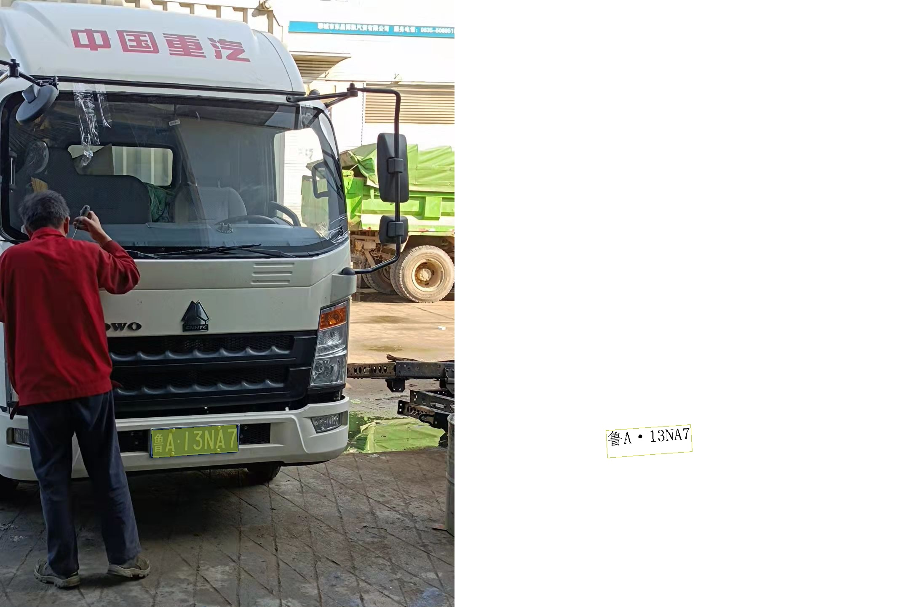

    
### PaddleOCRv3实现车牌识别

训练PaddleOCRv3模型，对于牌数据集CCPD进行预测，并导出模型可以支持直接调用。该实现脚本储存在 Paddleocrv3 文件夹下。

环境配置：
- PaddlePaddle: 2.3
- paddleslim: 2.2.2
- PaddleOCR: Release/2.

Predict

- 利用训练好的模型Predict ，见脚本： predict_paddleocr_plate..ipynb
- 预测结果如下：
     16.jpg	[{"transcription": "鲁A13NA7", "points": [[359, 1023], [560, 1009], [564, 1073], [363, 1088]], "recscore": 0.91103196144104}]

Train       

- 见脚本： train_vehicle license plate recognition.ipynb

